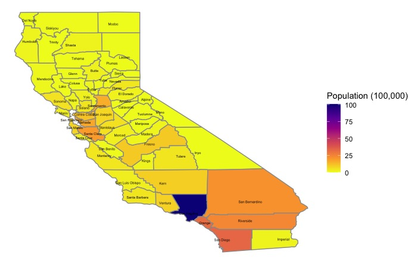

# CA Population Demographics

The files in this folder explores the use of different R packages to extract and use Census data. 

## 2019
Used the censusapi package to map population distribution across the counties and by age group.

Refer to the code here: [CA2019_agedist.Rmd](CA2019_agedist.Rmd])

## 2015
All the R files associated with 2015 was related to figuring out how to use the acs package and generate a population pyramid and time trend. (Don't think was finished.)